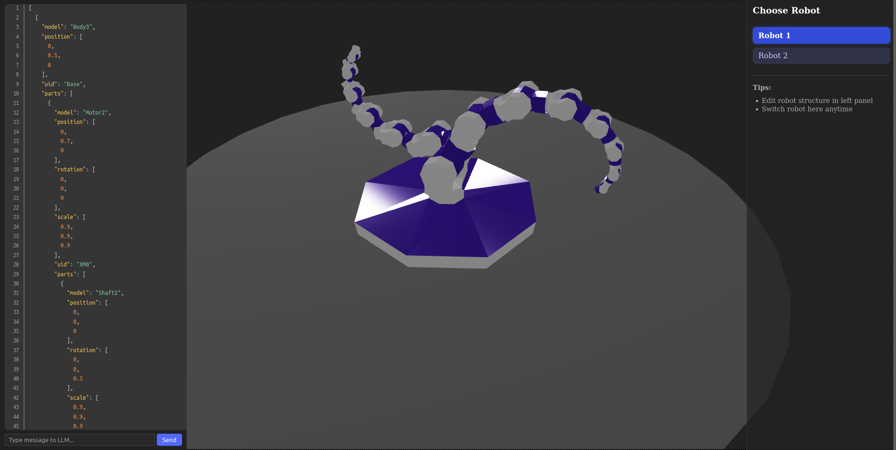

# NaBotCity: A Robotic Simulation Project

NaBotCity is a hobby project simulating robots. It's currently in early development, but the goal is to allow users to create and customize robots, integrate various sensors and modules, and program their behavior. **Future iterations** will allow for more complex interactions, including:

* **Custom Robot Creation:** Define robots using a simple JSON format. Easily tweak existing robots or create entirely new ones using LLMs or manual JSON editing.
* **Modular Design:**  Add various sensors (e.g., lidar, cameras) and actuators (e.g., wheels, arms) to your robots.
* **Software Installation:**  Simulate installing different software packages or configurations onto individual robots.
* **Collaborative Tasks:**  Design and execute complex, collaborative tasks involving multiple robots.  Examples include coordinated movement, object manipulation, and information sharing.
* **Precise Control:** Issue both low-level commands (e.g., "move to (x,y) and rotate 10 degrees") and high-level commands (e.g., "pick up the red boxes and place them on the table in order of size").
* **Environmental Awareness:** Simulate a realistic environment where robots can perceive and interact with their surroundings.

## Instruction
- To run project
    - Open 2 terminals in program root and run these command in each
    - `npm run client`
    - `npm run server`

